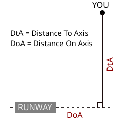

# DAAT User Manual

## Runtime

At startup and then periodically, the system will check for updated input sources.
There are two types of input sources: *AIXM* and *ZICAD*.
Checks for each are run separately.

The following properties govern these checks:
- `aixm.update.enabled` (default: `true`)
- `aixm.update.initial-delay` (in minutes, default: `0`)
- `aixm.update.fixed-delay` (in minutes, default: `60`)
- `zicad.update.enabled` (default: `true`)
- `zicad.update.initial-delay` (in minutes, default: `0`)
- `zicad.update.fixed-delay` (in minutes, default: `60`)

**Input sources are determined by looking through the Spring properties environment for the following properties:**
- `aixm.import.sources`
- `zicad.import.sources`

Each source has the following attributes:
- `uri`
- `description`

> The URI is the primary key of a datasource. IOW, the system will only attempt to import a datasource if it does not have any datasource with the same `uri` in store.

See:
- `com.mass.daat.AixmUpdateService`
- `com.mass.daat.ZicadUpdateService`

## Sample Data Source Configuration

The system has generally been deployed as part of a docker-compose deployment. In that context, data sources can easily be provided as environment properties for Spring to pick up. New data sources can then be added by editing the docker-compose file and refreshing the instances.

> A docker-compose sample is provided under [assets/sample-docker-compose.local.yml](/doc/assets/sample-docker-compose.local.yml).
> 
> Note that this sample assumes that the AIXM and ZICAD data has been added to the container with the backend service 
> under `/opt/daat-data/`. As this would require rebuilding the image to add new data sources, a more comprehensive solution would fetch those either from the Internet or from a mounted volume. 

## Data Ingestion

### AIXM

The system expects AIXM data sources in the format called AIRAC by the French SIA service and available here: https://www.sia.aviation-civile.gouv.fr/products-to-be-downloaded/aim-data.html.

> Data samples are available in the `/data/aixm` directory.

The data source may be in ZIP form or in expanded (directory) form.

Upon parsing, the system extracts a list of all aerodromes, all heliports 
and a selection of airspaces deemed relevant. 

Data for these items are extracted and their (spatial) geometry is computed (centre point for aerodromes and heliports, 2D geometry for airspaces).

> Altitude of aerodromes and heliports is generally not included in the dataset. It is computed during extraction by querying the configured [Altitude Service](#altitude-service). 
> 
> Depending on the speed of import, this can result in rate limitation on the altitude service. In that event, the system currently pauses a while before retrying, but a more sophisticated solution may prove necessary. 

The extracted items are then converted to database entities and then stored alongside metadata for the dataset. 

Data is only sent to the DB once everything has been successfully extracted. If an error occurs, the import process is aborted and the DB left unchanged.

See:
- Importer: `com.mass.daat.model.aixm.AixmImporter`
- Source Data Model: `com.mass.daat.model.aixm`
- DB Model: `com.mass.daat.db`

### ZICAD

ZICAD data and format definition are available here: https://www.data.gouv.fr/datasets/zones-interdites-a-la-captation-aerienne-des-donnees-zicad. The system expects a plain file for import.

A data sample is available in the `/data/zicad` directory.

Extraction works along the same lines as that of the AIXM data: ZICAD zones are extracted, their geometry computed, and the whole thing stored in the DB alongside metadata for the dataset. 

As with the AIXM import, data is only persisted after everything has been extracted successfully.

See:
- Importer: `com.mass.daat.model.zicad.ZicadImporter`
- Source Data Model: `com.mass.daat.model.zicad`
- DB Model: `com.mass.daat.db`

## Persistence

The system uses a MongoDB database for persistence. It has last been tested with MongoDB version 7.

All stored entities (aerodromes, heliports, airspaces and ZICAD zones) are stored with reference to a dataset entry
which contains metadata for the dataset they were extracted from, notably its validity period. This enters into play upon querying, see below. 

> Note that **geospatial indices** are used for performance (as querying is done based on a location). See entities in `com.mass.daat.db` for reference.

## Queries

The service sports a single REST endpoint under `/api/proximity/`. 
It takes GPS coordinates (latitude and longitude) as inputs. 
Common GPS coordinate formats should be supported (decimal as well as sexagesimal). 

> See `com.mass.daat.web.ProximityController`

### Response format

The response format is encoded in `com.mass.daat.geo.ProximityResponse`

### Methodology

> **The service first elects a dataset to use** (for each dataset type, so currently AIXM and ZICAD). 
> The elected dataset is the most recently imported dataset that is currently valid.

Using the elected datasets, the service then (in no particular order):

- computes the altitude for the query location using the configured [Altitude Service](#altitude-service);
- queries the database for the list of **aerodromes** in proximity of the query location. 
  - The proximity is determined by the setting `proximity-service.airport-max-distance-km` (default `20`).
  - The distance and bearing from the query location to each aerodrome are computed.
  - The relationship from the query location to each **runway** of each aerodrome are computed:
    - distance to the runway axis (how far from the runway axis is the query location?)
    - distance between the runway centre point and the point on the runway axis that's closest to the query location 
    - (note that runway centre point can be a little off sometimes).
    
- queries the database for the list of **heliports** in proximity of the query location.
  - The proximity is determined by the setting `proximity-service.heliport-max-distance-km` (default `10`).
  - The distance and bearing from the query location to each heliport are computed.
  - The distance from the query location to each TLA (Takeoff/Landing Area) for each heliport are computed.
- queries the database for the list of relevant **regulated airspaces** in proximity of the query location.
  - The proximity is determined by the setting `proximity-service.airspace-max-distance-km` (default `2`).
  - **Note:** Airspace type is represented by a string and is encoded in `com.mass.daat.model.aixm.AirspaceType`
  - The distance from the query location to each airspace is computed.
- queries the database for the list of relevant **ZICAD zones** in proximity of the query location.
  - The proximity is determined by the setting `proximity-service.zicad-max-distance-km` (default `2`).
  - The distance from the query location to each ZICAD zone is computed.

### Caching

Responses are **cached** based on query coordinates. Cache properties are defined under `cache.proximity-info`. 
See [application.yml](/src/main/resources/application.yml) for details.

### Rate-limiting

The proximity endpoint is rate limited by default, based on the request's remote IP. 
See `bucket4j` properties in [application.yml](/src/main/resources/application.yml) for details.   

## Altitude Service

The system defines an abstract AltitudeService for resolving the altitude at a given GPS coordinate.

The current implementation is based on the French [IGN's altimetry service](https://geoservices.ign.fr/services-geoplateforme-altimetrie).

It is implemented in `com.mass.daat.geo.IgnAltitudeService`. 

Be aware that this service will only work for coordinates that are on French soil.

See `altitude-service` properties in [application.yml](/src/main/resources/application.yml) as well as `com.mass.daat.geo.GeoConfiguration`.

Responses from the altitude service are cached by default.

### Rate-limiting on the IGN altimetry service

When importing data, many altitude resolution attempts are performed in quick succession, as 
the system computes the elevation for each aerodrome and heliport, and there is currently no bundling of these requests.
This has been shown to lead to rejections from the remote service, which appear as `HTTP 429 TOO_MANY_REQUESTS` errors. 
This can lead to a dataset import failing altogether, as a single error is sufficient for that.

This is very unlikely to happen during normal servicing of requests, in particular due to the rate-limiter on the proximity service endpoint.

A quick (and likely optimistic) fix has currently been applied, to retry the request 
after a brief timeout (2 seconds). If this proves insufficient, it will likely be necessary to batch up altitude resolution queries. 
The remote endpoint supports this, but it would require a bit of refactoring of the import process.

